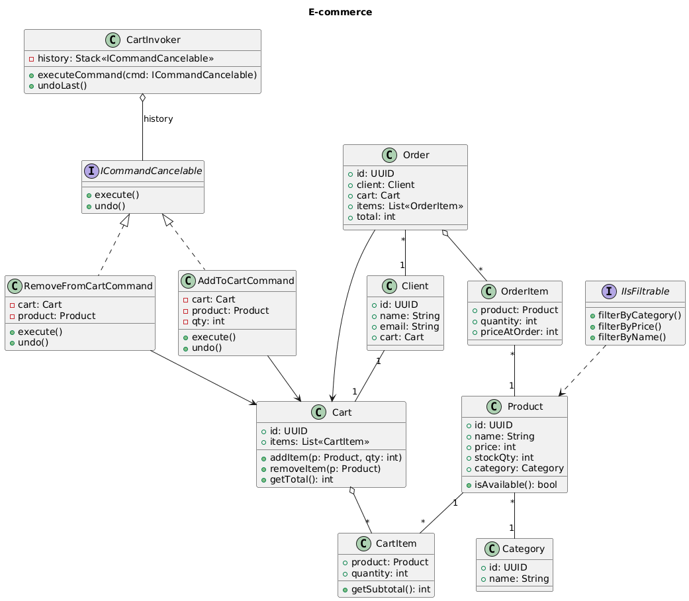

# Panier E-Commerce

Application Java de gestion de panier e-commerce implémentant plusieurs design patterns.

## Description

Cette application simule un système de panier d'achat en ligne avec gestion des produits, catégories, clients et commandes. Elle met en œuvre des design patterns pour une architecture flexible et maintenable.

## Architecture



### Patterns utilisés

- **Command Pattern** : Pour la gestion des opérations sur le panier (ajout/suppression) avec possibilité d'annulation (undo)
- **Observer Pattern** : Pour notifier l'entrepôt automatiquement lors de la création d'une commande

### Structure du projet

```
src/main/java/com/adatech/panier/
├── model/              # Modèles métier
│   ├── Product.java
│   ├── Category.java
│   ├── Cart.java
│   ├── CartItem.java
│   ├── Client.java
│   ├── Order.java
│   └── OrderItem.java
├── service/            # Logique métier
│   ├── CartService.java
│   └── OrderService.java
├── controller/         # Contrôleurs (non utilisés - préparation future API)
│   ├── CartController.java
│   └── OrderController.java
├── command/            # Pattern Command
│   ├── ICommandCancelable.java
│   ├── AddToCartCommand.java
│   ├── RemoveFromCartCommand.java
│   └── CartInvoker.java
├── observer/           # Pattern Observer
│   ├── IOrderObserver.java
│   └── WarehouseObserver.java
└── App.java            # Point d'entrée avec démonstration
```

## Fonctionnalités

### Gestion des produits

- Création de produits avec catégories
- Vérification de disponibilité en stock

### Gestion du panier

- Ajout/suppression de produits
- Calcul automatique des totaux
- Historique avec possibilité d'annulation (undo)

### Gestion des commandes

- Création de commande à partir d'un panier
- Capture du prix au moment de la commande
- Validation du panier non vide
- Notification automatique de l'entrepôt (pattern Observer)

## Exécution

Compiler et lancer l'application :

```bash
javac -d bin src/main/java/com/adatech/panier/**/*.java
java -cp bin com.adatech.panier.App
```

L'application exécute une démonstration complète des fonctionnalités :

1. Création de catégories et produits
2. Vérification de disponibilité des produits
3. Ajout/suppression d'articles au panier avec pattern Command
4. Test des commandes undo
5. Création de commande avec notification de l'entrepôt (pattern Observer)
6. Validation des erreurs

## Dépendances

- Java 17+
- Aucune dépendance externe

## Notes

Les contrôleurs sont présents dans l'architecture mais non utilisés dans cette version console. Ils sont prévus pour une future implémentation d'API REST ou d'interface graphique.
